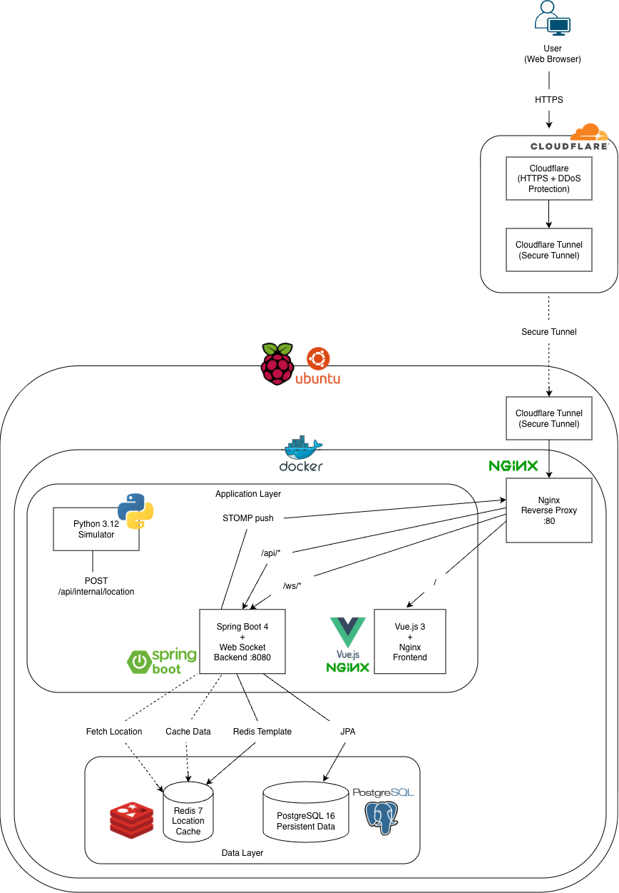
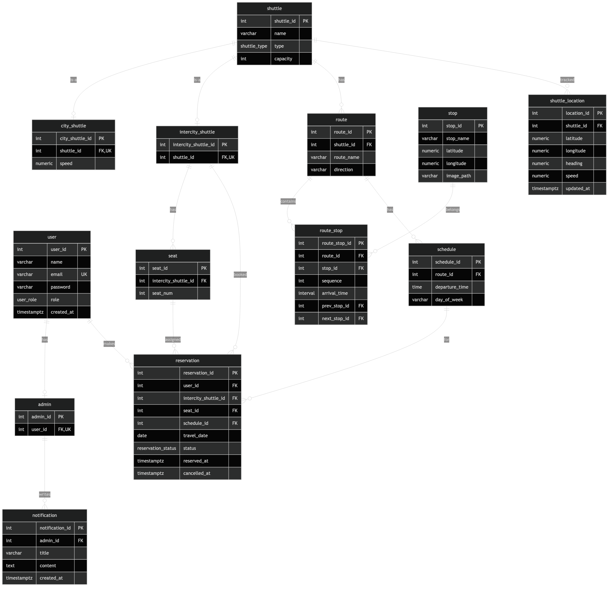

# 🚌 연세 셔틀 (Yonsei Shuttle)

연세대학교 미래캠퍼스 셔틀버스 운행 정보 및 예약 웹 서비스

> 백엔드/프론트엔드/인프라를 단독 설계 및 구현한 풀스택 포트폴리오 프로젝트

---

## 📋 목차

- [프로젝트 개요](#-프로젝트-개요)
- [주요 기능](#-주요-기능)
- [기술 스택](#-기술-스택)
- [시스템 아키텍처](#-시스템-아키텍처)
- [데이터베이스 설계](#-데이터베이스-설계)
- [프로젝트 구조](#-프로젝트-구조)
- [실행 방법](#-실행-방법)
- [API 문서](#-api-문서)
- [배포](#-배포)

---

## 🎯 프로젝트 개요

연세대학교 미래캠퍼스에서 운행하는 시내/시외 셔틀버스 정보를 조회하고, 시외 셔틀을 예약할 수 있는 서비스입니다.

**핵심 가치**
- 실제 GPS 연동 한계를 Python 기반 **위치 시뮬레이션**으로 대체
- Redis 캐시 + WebSocket으로 **실시간 위치 push**
- Docker Compose 한 번으로 전체 시스템 자동 배포
- 라즈베리파이에서 **자체 호스팅**하여 Cloudflare Tunnel로 외부 공개

**개발 배경**
- 기존에 하드코딩으로 구현한 프론트엔드 프로젝트([ShuttleTemp](#))를 본격적인 풀스택 시스템으로 확장
- 백엔드 API 서버 설계, JPA 도메인 모델링, JWT 인증, WebSocket 통신, 컨테이너 오케스트레이션 등 실무 기술 학습

---

## ✨ 주요 기능

### 사용자 기능
| 기능 | 설명 |
|---|---|
| 🔐 회원가입 / 로그인 | JWT 기반 인증, Access / Refresh Token 분리 |
| 📢 공지사항 조회 | 목록 / 상세 |
| 🚌 노선 조회 | 시내 / 시외 필터, 정류장 순서 + 소요 시간 표시 |
| 🗓️ 시간표 조회 | 노선별 운행 시간, 요일 필터 (평일/토/일) |
| 🎫 시외 셔틀 예약 | 날짜 선택 → 잔여 좌석 확인 → 좌석 선택 → 예약 |
| 📝 예약 내역 / 취소 | 본인 예약만 조회/취소 가능 |
| 🗺️ 실시간 위치 | Leaflet 지도 + WebSocket STOMP 실시간 push |

### 관리자 기능
| 기능 | 설명 |
|---|---|
| 🚌 셔틀 CRUD | 시내/시외 셔틀 등록, 삭제 (타입별 확장 테이블 자동 생성) |
| 🛣️ 노선 CRUD | 노선 생성/삭제 |
| 📍 정류장 CRUD | 정류장 생성/삭제 |
| 🗓️ 시간표 CRUD | 시간표 생성/삭제 |
| 📣 공지사항 CRUD | 공지 작성/수정/삭제 |

### 시스템 기능
| 기능 | 설명 |
|---|---|
| 🤖 Python Simulator | 노선 정류장 좌표 선형 보간 → 실시간 위치 자동 생성 |
| ⚡ Redis 캐시 | 셔틀 최신 위치 TTL 5분, 위치 조회 < 1ms |
| 📡 WebSocket (STOMP) | 위치 변경 시 구독 중인 모든 클라이언트에 즉시 push |
| 🔒 Spring Security + JWT | USER / ADMIN 역할 기반 접근 제어 |
| 📚 Swagger UI | API 자동 문서화 |

---

## 🛠️ 기술 스택

### Backend


-010101?style=flat-square&logo=socketdotio&logoColor=white)


### Frontend


### Database / Cache


### Simulator


### Infra / Deployment


### Tools


---

## 🏗️ 시스템 아키텍처


### 배포 구성

```
🌐 Internet
    ↓ HTTPS
☁️ Cloudflare (HTTPS + DDoS 방어)
    ↓ 암호화 터널
🥧 Raspberry Pi 4 (Ubuntu Server)
    └─ cloudflared (Tunnel Daemon)
        └─ 🐳 Docker Compose
            ├─ Nginx (Reverse Proxy, :80)
            ├─ Vue.js Frontend
            ├─ Spring Boot Backend (:8080)
            ├─ Python Simulator
            ├─ PostgreSQL (:5432)
            └─ Redis (:6379)
```

### 주요 데이터 흐름

#### 1) 시외 셔틀 예약
```
User → Vue.js → POST /api/reservations
  → JWT 인증 → ReservationController → ReservationService
  → 좌석 가용 확인 (Seat + Schedule + travelDate)
  → PostgreSQL (UNIQUE 제약으로 중복 예약 방지)
```

#### 2) 실시간 위치 (WebSocket + Redis)
```
Python Simulator (매 N초 좌표 생성)
  → POST /api/internal/location → Spring Boot
    ├── Redis 캐싱 (TTL 5분)
    ├── PostgreSQL 이력 저장
    └── WebSocket(STOMP) push
      → /topic/shuttle-location/{shuttleId}
      → Vue.js LiveMap 실시간 반영
```

#### 3) ETA 계산
```
LocationService (Redis에서 현재 좌표 조회)
  → DistanceCalculator (Haversine 공식)
  → RouteStop 순서 기반 누적 거리 계산
  → 평균 속도로 분 단위 ETA 산출
```

### 레이어드 아키텍처 (Backend)

```
┌─────────────────────────────────────────┐
│ Presentation (Controller)               │
│ Auth / Shuttle / Reservation / Location │
│ Notification / Admin                    │
├─────────────────────────────────────────┤
│ Service (Business Logic)                │
│ @Transactional, Cross-entity 로직        │
├─────────────────────────────────────────┤
│ Repository (Spring Data JPA)            │
│ JpaRepository + Query Method            │
├─────────────────────────────────────────┤
│ Domain (Entity)                         │
│ User/Admin, Shuttle/Route/Stop,         │
│ Reservation/Seat, ShuttleLocation 등     │
└─────────────────────────────────────────┘
```

---

## 🗄️ 데이터베이스 설계



### 주요 테이블 (13개)

| 테이블 | 설명 |
|---|---|
| `user` | 사용자 (USER / ADMIN 역할 통합) |
| `admin` | 관리자 확장 정보 (user 1:1) |
| `notification` | 공지사항 |
| `shuttle` | 셔틀 기본 정보 (시내 / 시외 공통) |
| `city_shuttle` | 시내 셔틀 확장 (평균 속도 등) |
| `intercity_shuttle` | 시외 셔틀 확장 (예약 대상) |
| `route` | 셔틀 노선 |
| `stop` | 정류장 |
| `route_stop` | 노선별 경유 정류장 (순서 + 소요 시간) |
| `schedule` | 운행 시간표 |
| `seat` | 시외 셔틀 좌석 |
| `reservation` | 시외 셔틀 예약 |
| `shuttle_location` | 셔틀 실시간 위치 이력 |

### 주요 설계 포인트

- **User-Admin 분리**: 공통 필드는 `user` 테이블, 관리자 전용 필드는 `admin` 테이블 (1:1 확장)
- **Shuttle 서브타입**: `shuttle` 공통 테이블 + `city_shuttle` / `intercity_shuttle` 확장 (Table Inheritance)
- **중복 예약 방지**: `UNIQUE (seat_id, schedule_id, travel_date)` 제약
- **탑승 날짜**: `reservation.travel_date` 컬럼으로 시간표 재사용 (월-금 운행 시간표 + 날짜 별 예약 구분)
- **정류장 순서**: `route_stop.sequence` + `prev_stop_id` / `next_stop_id` linked list
- **최신 위치 조회**: `v_shuttle_current_location` VIEW + 인덱스 최적화

상세 스키마: [docs/schema.sql](docs/schema.sql), [docs/schema.dbml](docs/schema.dbml)

---

## 📂 프로젝트 구조

```
yonsei-shuttle/
├── backend/                   # Spring Boot 4 (com.yonsei.shuttle)
│   ├── src/main/java/com/yonsei/shuttle/
│   │   ├── YonseiShuttleApplication.java
│   │   ├── common/           # Config, Exception, Response, Util
│   │   ├── auth/             # 회원가입/로그인/JWT
│   │   ├── user/             # User, Admin 도메인
│   │   ├── shuttle/          # 셔틀/노선/정류장/시간표
│   │   ├── reservation/      # 예약, 좌석
│   │   ├── location/         # 실시간 위치, ETA, WebSocket
│   │   ├── notification/     # 공지사항
│   │   └── admin/            # 관리자 API
│   ├── src/main/resources/
│   │   ├── application.yml
│   │   ├── application-dev.yml
│   │   ├── application-prod.yml
│   │   └── db/schema.sql
│   ├── build.gradle
│   └── Dockerfile
│
├── frontend/                  # Vue 3 + Vite
│   ├── src/
│   │   ├── main.js
│   │   ├── App.vue
│   │   ├── router/           # Vue Router
│   │   ├── stores/           # Pinia (auth)
│   │   ├── api/              # axios 모듈
│   │   ├── views/
│   │   │   ├── user/         # 사용자 페이지 11개
│   │   │   └── admin/
│   │   ├── components/
│   │   │   └── common/       # Header, Footer, Layout
│   │   └── assets/css/
│   ├── vite.config.js
│   ├── nginx.conf
│   └── Dockerfile
│
├── simulator/                 # Python 3.12 위치 시뮬레이터
│   ├── main.py
│   ├── config.py
│   ├── simulator/
│   │   ├── api_client.py     # Backend API 호출
│   │   ├── route_loader.py   # 노선/정류장 로드
│   │   ├── position_generator.py  # 선형 보간 + Haversine
│   │   └── schedule_runner.py # 주기적 위치 전송
│   ├── requirements.txt
│   └── Dockerfile
│
├── infra/                     # 인프라 & 배포
│   ├── docker-compose.yml
│   ├── nginx/nginx.conf      # Reverse Proxy
│   ├── postgres/
│   └── scripts/
│
├── docs/
│   ├── architecture.md / .png / .svg
│   ├── erd.md / .png / .svg
│   ├── schema.sql / .dbml
│   └── schema.dbdiagram
│
└── README.md
```

---

## 🚀 실행 방법

### 사전 요구 사항
- Docker Desktop
- Git

### 1) 프로젝트 클론
```bash
git clone https://github.com/<your-username>/yonsei-shuttle.git
cd yonsei-shuttle
```

### 2) 전체 시스템 실행 (한 방에)
```bash
cd infra
docker compose up -d --build
```

처음 실행 시 이미지 빌드에 약 5~10분 소요됩니다.

### 3) 서비스 확인
```bash
docker compose ps
```

모든 서비스가 `Up` 상태여야 합니다.

### 4) 접속
| 서비스 | URL |
|---|---|
| 웹 클라이언트 | http://localhost |
| Swagger UI | http://localhost/swagger-ui/index.html |
| PostgreSQL | localhost:5432 (`shuttle` / `shuttle1234`) |
| Redis | localhost:6379 |

### 5) 초기 데이터 입력 (테스트용)
```bash
# 관리자 계정 생성
curl -s -X POST http://localhost/api/auth/signup \
  -H "Content-Type: application/json" \
  -d '{"name":"관리자","email":"admin@yonsei.ac.kr","password":"admin1234"}'

# role을 ADMIN으로 변경
docker exec yonsei-postgres psql -U shuttle -d yonsei_shuttle -c "
SET search_path TO yonsei_shuttle;
UPDATE \"user\" SET role = 'ADMIN' WHERE email = 'admin@yonsei.ac.kr';
INSERT INTO admin (user_id) SELECT user_id FROM \"user\" WHERE email = 'admin@yonsei.ac.kr';
"
```

### 6) 종료
```bash
docker compose down          # 컨테이너만 종료 (DB 데이터 유지)
docker compose down -v       # 볼륨까지 삭제 (초기화)
```

### 개별 모듈 개발 모드 실행 (선택)

#### Backend만 실행
```bash
cd backend
./gradlew bootRun --args='--spring.profiles.active=dev'
```

#### Frontend만 실행 (Hot Reload)
```bash
cd frontend
npm install
npm run dev
# → http://localhost:5173
```

#### Simulator 단독 실행
```bash
cd simulator
python3 -m venv venv && source venv/bin/activate
pip install -r requirements.txt
python3 main.py
```

---

## 📚 API 문서

전체 API는 **Swagger UI**에서 확인할 수 있습니다:

```
http://localhost/swagger-ui/index.html
```

### 주요 엔드포인트

<details>
<summary><b>Auth (3)</b></summary>

| Method | Path | 설명 |
|---|---|---|
| POST | `/api/auth/signup` | 회원가입 |
| POST | `/api/auth/login` | 로그인 (JWT 발급) |
| POST | `/api/auth/refresh` | Access Token 재발급 |
</details>

<details>
<summary><b>Shuttle (10)</b></summary>

| Method | Path | 설명 |
|---|---|---|
| GET | `/api/shuttles` | 전체 셔틀 목록 (type 필터) |
| GET | `/api/shuttles/{id}` | 셔틀 단건 조회 |
| GET | `/api/shuttles/routes` | 전체 노선 목록 |
| GET | `/api/shuttles/{id}/routes` | 셔틀별 노선 |
| GET | `/api/shuttles/routes/{id}` | 노선 단건 |
| GET | `/api/shuttles/stops` | 전체 정류장 |
| GET | `/api/shuttles/stops/{id}` | 정류장 단건 |
| GET | `/api/shuttles/routes/{id}/stops` | 노선별 정류장 (순서 포함) |
| GET | `/api/shuttles/routes/{id}/schedules` | 노선별 시간표 |
| GET | `/api/shuttles/routes/{id}/schedules/{day}` | 요일별 시간표 |
</details>

<details>
<summary><b>Reservation (5)</b></summary>

| Method | Path | 설명 |
|---|---|---|
| POST | `/api/reservations` | 예약 생성 |
| GET | `/api/reservations` | 내 예약 목록 |
| GET | `/api/reservations/{id}` | 예약 단건 |
| PATCH | `/api/reservations/{id}/cancel` | 예약 취소 |
| GET | `/api/reservations/seats` | 좌석 가용 현황 |
</details>

<details>
<summary><b>Location (3)</b></summary>

| Method | Path | 설명 |
|---|---|---|
| GET | `/api/shuttles/locations` | 모든 운행 셔틀 위치 |
| GET | `/api/shuttles/{id}/location` | 셔틀 현재 위치 |
| GET | `/api/shuttles/{id}/eta?routeId=` | 정류장별 ETA |
</details>

<details>
<summary><b>Notification (2)</b></summary>

| Method | Path | 설명 |
|---|---|---|
| GET | `/api/notifications` | 공지사항 목록 |
| GET | `/api/notifications/{id}` | 공지사항 단건 |
</details>

<details>
<summary><b>Admin — Shuttle CRUD (8)</b></summary>

| Method | Path | 설명 |
|---|---|---|
| POST | `/api/admin/shuttles` | 셔틀 생성 |
| DELETE | `/api/admin/shuttles/{id}` | 셔틀 삭제 |
| POST | `/api/admin/shuttles/routes` | 노선 생성 |
| DELETE | `/api/admin/shuttles/routes/{id}` | 노선 삭제 |
| POST | `/api/admin/shuttles/stops` | 정류장 생성 |
| DELETE | `/api/admin/shuttles/stops/{id}` | 정류장 삭제 |
| POST | `/api/admin/shuttles/schedules` | 시간표 생성 |
| DELETE | `/api/admin/shuttles/schedules/{id}` | 시간표 삭제 |
</details>

<details>
<summary><b>Admin — Notification CRUD (3)</b></summary>

| Method | Path | 설명 |
|---|---|---|
| POST | `/api/admin/notifications` | 공지 작성 |
| PUT | `/api/admin/notifications/{id}` | 공지 수정 |
| DELETE | `/api/admin/notifications/{id}` | 공지 삭제 |
</details>

<details>
<summary><b>Internal (시뮬레이터 전용)</b></summary>

| Method | Path | 설명 |
|---|---|---|
| POST | `/api/internal/location` | 셔틀 위치 업데이트 |
| GET | `/api/internal/shuttles` | 셔틀 조회 (인증 없음) |
| GET | `/api/internal/shuttles/{id}/routes` | 노선 조회 |
| GET | `/api/internal/shuttles/routes/{id}/stops` | 정류장 조회 |
| GET | `/api/internal/shuttles/routes/{id}/schedules` | 시간표 조회 |
</details>

---

## 🌍 배포

### 라즈베리파이 4 + Cloudflare Tunnel

본 프로젝트는 개인 소유 **Raspberry Pi 4 (Ubuntu Server 22.04)** 에 Docker Compose로 배포되어 있으며, **Cloudflare Tunnel**을 통해 외부 공개됩니다.

**배포 특징**
- 외부에 직접 노출되는 포트 **0개** (Cloudflare Tunnel이 유일한 진입점)
- HTTPS 자동 (Cloudflare가 인증서 관리)
- DDoS 방어 내장
- 공유기 포트포워딩 불필요 (outbound 연결만 사용)
- systemd 서비스 등록으로 재부팅 시 자동 실행

**자체 호스팅 선택 이유**
- 학습 목적: 서버 관리, 네트워크, 컨테이너 운영 실제 경험
- 비용: 클라우드 대비 거의 0원
- 보안: Cloudflare Tunnel로 outbound-only 아키텍처 구현

---

## 📖 설계 결정 기록 (ADR)

### 1) PostgreSQL ENUM ↔ Java Enum 매핑
- DB 저장값은 한글(`시내`/`시외`, `예약`/`취소`), Java Enum은 영문
- `AttributeConverter` + `@JdbcTypeCode(SqlTypes.VARCHAR)` + `columnDefinition = "enum_name"` 조합으로 매핑
- `stringtype=unspecified` JDBC 파라미터로 자동 캐스팅 허용

### 2) 중복 예약 방지 설계
- Application 레벨: `existsBySeat_SeatIdAndSchedule_ScheduleIdAndTravelDateAndStatus()` 체크
- DB 레벨: `UNIQUE (seat_id, schedule_id, travel_date)` 제약 (이중 안전장치)
- 동시 요청으로 Application 체크 통과한 두 요청도 DB에서 한 건만 성공

### 3) Redis 캐시 전략
- 셔틀 위치는 매 N초 갱신되는 휘발성 데이터 → `TTL 5분` 설정
- Frontend 조회 시 Redis 우선 → 캐시 미스 시 DB fallback
- 위치 이력은 `shuttle_location` 테이블에 별도 저장 (분석/이력 용도)

### 4) WebSocket 토픽 구조
- `/topic/shuttle-location/{shuttleId}` — 셔틀별 구독
- 프론트엔드는 시야에 있는 셔틀만 선택 구독 가능

### 5) 시뮬레이터의 시간 기반 위치 보간
- `route_stop.arrival_time_minutes`(출발지 대비 누적 소요시간)를 기반으로 선형 보간
- `SIMULATION_SPEED_MULTIPLIER` 환경변수로 시뮬레이션 가속 (테스트 시 10배 속도)

### 6) Vue 2 → Vue 3 개선
- 이전 하드코딩 프로젝트의 `Options API` + `Vuex` → `Composition API` + `Pinia`
- 노선/시간표별 20+ 중복 페이지 → 동적 라우트 (`/routes/:id/stops`, `/routes/:id/schedules`) 로 2개 컴포넌트 통합
- localStorage 예약 → 실제 Backend API 연동

---

## 👤 Author

**Hannah Cho**
- GitHub: [@hannahcho](https://github.com/hannahcho)

---
