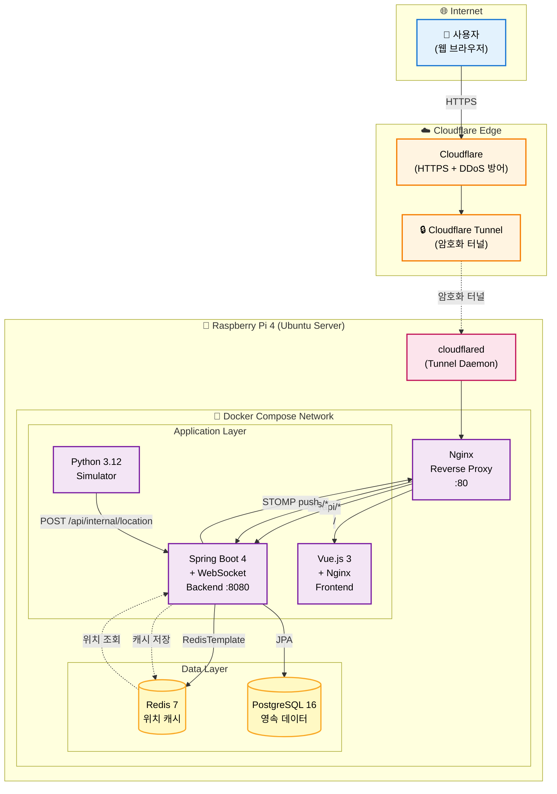

# 연세 셔틀 - 시스템 아키텍처



## 주요 흐름

### 1. 일반 요청 (REST API)
```
사용자 → Cloudflare HTTPS → Cloudflare Tunnel → cloudflared → Nginx
  → /api/* → Backend → PostgreSQL / Redis
```

### 2. 실시간 위치 (WebSocket)
```
사용자 → WebSocket 연결 (/ws) → Backend (STOMP broker)
Simulator → POST /api/internal/location → Backend
  → Redis 캐싱 + DB 저장
  → STOMP push → 구독 중인 모든 클라이언트
```

### 3. 정적 파일 (Frontend SPA)
```
사용자 → Cloudflare → Tunnel → Nginx
  → / → Frontend(Nginx in container) → index.html + JS/CSS
```

## 기술 스택

| Layer | Tech |
|---|---|
| Edge | Cloudflare Tunnel (무료), Cloudflare HTTPS |
| Host OS | Ubuntu Server 22.04 LTS (aarch64) |
| Hardware | Raspberry Pi 4 |
| Container | Docker + Docker Compose |
| Reverse Proxy | Nginx |
| Backend | Java 21, Spring Boot 4, Spring Security + JWT, JPA, WebSocket(STOMP) |
| Frontend | Vue 3 (Composition API), Vite, Pinia, Vue Router, Bootstrap 5, Leaflet |
| Simulator | Python 3.12, requests |
| Database | PostgreSQL 16 |
| Cache | Redis 7 |
| Tools | GitHub, Gradle, npm |

## 포트 구성

| 서비스 | 컨테이너 포트 | 외부 노출 |
|---|---|---|
| Nginx | 80 | ❌ (Cloudflare Tunnel만) |
| Frontend | 80 | ❌ (내부 네트워크) |
| Backend | 8080 | ❌ (내부 네트워크) |
| PostgreSQL | 5432 | ❌ (내부 네트워크) |
| Redis | 6379 | ❌ (내부 네트워크) |
| Simulator | - | ❌ (outbound only) |

> **보안**: 외부에 직접 노출되는 포트 없음. Cloudflare Tunnel이 유일한 진입점.
