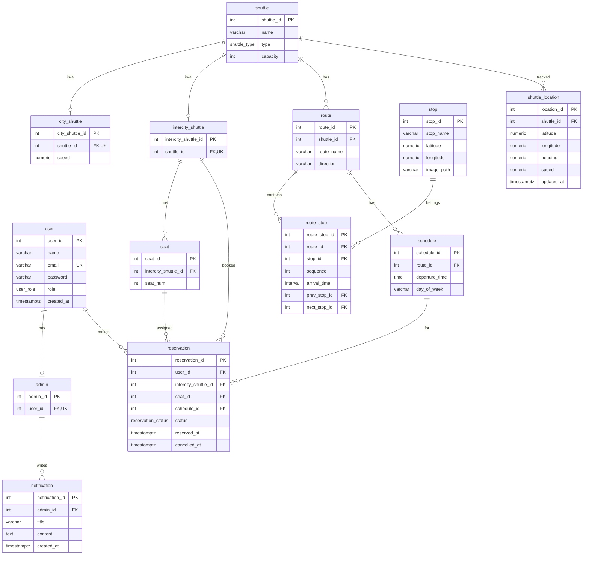

```mermaid
erDiagram
    %% ===== User & Auth =====
    user {
        int user_id PK
        varchar name
        varchar email UK
        varchar password
        user_role role
        timestamptz created_at
    }

    admin {
        int admin_id PK
        int user_id FK, UK
    }

    notification {
        int notification_id PK
        int admin_id FK
        varchar title
        text content
        timestamptz created_at
    }

    %% ===== Shuttle =====
    shuttle {
        int shuttle_id PK
        varchar name
        shuttle_type type
        int capacity
    }

    city_shuttle {
        int city_shuttle_id PK
        int shuttle_id FK, UK
        numeric speed
    }

    intercity_shuttle {
        int intercity_shuttle_id PK
        int shuttle_id FK, UK
    }

    %% ===== Route & Stop =====
    route {
        int route_id PK
        int shuttle_id FK
        varchar route_name
        varchar direction
    }

    stop {
        int stop_id PK
        varchar stop_name
        numeric latitude
        numeric longitude
        varchar image_path
    }

    route_stop {
        int route_stop_id PK
        int route_id FK
        int stop_id FK
        int sequence
        interval arrival_time
        int prev_stop_id FK
        int next_stop_id FK
    }

    schedule {
        int schedule_id PK
        int route_id FK
        time departure_time
        varchar day_of_week
    }

    %% ===== Reservation =====
    seat {
        int seat_id PK
        int intercity_shuttle_id FK
        int seat_num
    }

    reservation {
        int reservation_id PK
        int user_id FK
        int intercity_shuttle_id FK
        int seat_id FK
        int schedule_id FK
        reservation_status status
        timestamptz reserved_at
        timestamptz cancelled_at
    }

    %% ===== Location =====
    shuttle_location {
        int location_id PK
        int shuttle_id FK
        numeric latitude
        numeric longitude
        numeric heading
        numeric speed
        timestamptz updated_at
    }

    %% ===== Relationships =====
    user ||--o| admin : "has"
    admin ||--o{ notification : "writes"

    shuttle ||--o| city_shuttle : "is-a"
    shuttle ||--o| intercity_shuttle : "is-a"
    shuttle ||--o{ route : "has"
    shuttle ||--o{ shuttle_location : "tracked"

    route ||--o{ route_stop : "contains"
    route ||--o{ schedule : "has"

    stop ||--o{ route_stop : "belongs"

    intercity_shuttle ||--o{ seat : "has"
    intercity_shuttle ||--o{ reservation : "booked"

    user ||--o{ reservation : "makes"
    seat ||--o{ reservation : "assigned"
    schedule ||--o{ reservation : "for"
```
